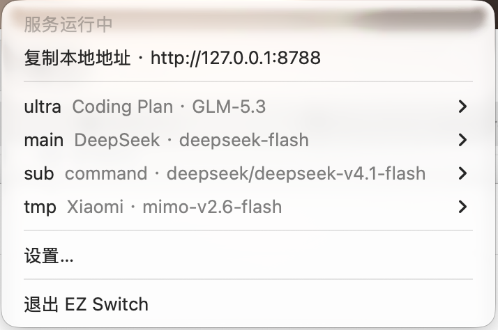

# EZ Switch

**轻量级 macOS 原生大模型反向代理工具。**

EZ Switch 在本机提供 OpenAI / Anthropic 兼容接口。Codex、Claude Code 可一键接入本机端点，无需逐个选择模型；兼容的本机模型 ID 都可按需指定。OpenCode 可通过应用生成的提示词配置全部本机模型 ID。之后在 EZ Switch 中切换真实供应商和模型，立即生效，不需要修改 harness 配置或重启客户端。

## 为什么用 EZ Switch

- **热切换模型**：工具侧始终请求固定的本机模型 ID，真实上游模型可在 GUI 或菜单栏中随时切换。
- **集中管理供应商**：API Key、Base URL、请求头和模型列表统一放在 EZ Switch，不需要在每个工具里重复配置。
- **本地原生应用**：macOS 原生 GUI，服务只监听 `127.0.0.1`，请求直接转发到配置的上游。

## 安装

从 [GitHub Releases](https://github.com/LuohaoSun/ez-switch/releases) 下载最新 `EZSwitch-*.dmg`，打开后将 `EZ Switch.app` 拖入 `Applications` 文件夹。要求 macOS 13 或以上。

> 当前 DMG 使用 ad-hoc 签名，未经过 Apple Developer ID 公证。首次启动如被 macOS 阻止，请前往 `系统设置 → 隐私与安全性`，在安全提示中点击 **“仍要打开”**，然后再次确认打开应用。

## 使用

首次启动会打开设置窗口，并预置 `DeepSeek官方 · deepseek-flash` 和 `OpenCode Go · deepseek-v4.1-flash` 两个供应商示例；`main` 默认指向 OpenCode Go。进入“供应商”页，选择对应供应商并填写自己的 API Key（Go 需要订阅密钥）；默认模型和 Base URL 可以按需修改。已有配置不会被更新为新示例。

OpenCode Go 使用 Chat Completions 地址 `https://opencode.ai/zen/go/v1`，要求请求包含每个对话稳定的 `x-opencode-session` 和客户端 `User-Agent`。EZ Switch 转发客户端传入的会话头，并在没有 `User-Agent` 时使用自身标识；不在供应商的额外请求头中设置固定会话 ID。客户端不发送会话头时，EZ Switch 无法推断对话归属，Go 的会话路由和缓存效果可能受影响。

本地服务默认地址：

```text
http://127.0.0.1:8788
```

应用启动时及运行期间每 24 小时会自动检查更新（可在“通用”页关闭），发现新版本后会在菜单栏提示；也可以在“通用”页手动检查。下载更新时会校验 DMG 的 SHA-256 并打开安装，不会自动安装。

### 1. 配置供应商

在“供应商”页添加或编辑供应商：

- 供应商名称和模型 ID
- Chat Completions、Responses、Messages 三类接口是否启用
- 每类接口对应的完整 Base URL
- API Key 和可选额外请求头

同一供应商的 API Key 和接口配置统一生效，供应商下的全部模型共用。

### 2. 配置路由

首次启动会预置一个固定的本机模型 ID：

```text
main
```

`main` 会绑定到需要的供应商模型。也可以在“路由”页添加多个本机模型 ID，并分别绑定上游模型。Codex 和 Claude Code 自动选择一个兼容 ID 作为默认模型，其余兼容 ID 可在工具中显式指定；OpenCode 的提示词会包含全部本机模型 ID。

### 3. 接入工具

在“通用”页的“接入工具”中，从 Codex、Claude Code、OpenCode 三项中选择要接入的工具：

- **Codex**：点击“一键配置”即可接入本机端点，无需逐个选模型；自动优先以支持 Responses 协议的 `main` 为默认模型（否则使用第一个兼容 ID）。其他兼容 ID 可用 `codex -m <ID>` 指定。
- **Claude Code**：点击“一键配置”即可接入本机端点，无需逐个选模型；自动优先以支持 Messages 协议的 `main` 为默认模型（否则使用第一个兼容 ID）。其他兼容 ID 可用 `claude --model <ID>` 指定。
- **OpenCode**：选择后，页面会展示包含端点、密钥占位符和全部本机模型 ID 的提示词，可通过“复制提示词”交给 agent；OpenCode 不提供一键配置或一键恢复。

使用 Codex 或 Claude Code 的一键配置时，应用会在确认后修改用户级配置并备份原文件；“一键恢复”检测到文件后续变化时会停止并保留备份，避免通常情况下覆盖新设置。跨进程的同时写入无法保证完全避免，请勿在其他工具正编辑同一配置时操作。备份位于 `~/Library/Application Support/EZSwitch/HarnessBackups/`，其中可能含有原配置的密钥。重新启动对应工具后生效；项目级、命令行或组织管理的设置仍可能覆盖用户级设置。其他本机模型能否成功请求取决于当前上游是否支持该工具使用的 API 协议；Codex 的内置模型列表不一定列出这些自定义 ID。

Codex 示例配置：

```toml
model = "main"
model_provider = "ezswitch"

[model_providers.ezswitch]
name = "EZ Switch"
base_url = "http://127.0.0.1:8788/v1"
wire_api = "responses"
env_key = "EZSWITCH_KEY"
```

```bash
export EZSWITCH_KEY=any-local-placeholder
codex
```

这里的 key 只用于满足工具的启动检查；真实上游 API Key 保存在 EZ Switch 中。
一键配置会直接在用户级 Codex provider 中写入 `ez-switch-local` 占位 token，无需设置上面示例的 `EZSWITCH_KEY`；手动配置时仍可选择环境变量方式。

其他 OpenAI-compatible 工具可填写：

```text
base_url = http://127.0.0.1:8788/v1
api_key  = any-local-placeholder
model    = main
```

Claude Code 可设置：

```bash
export ANTHROPIC_BASE_URL=http://127.0.0.1:8788
export ANTHROPIC_AUTH_TOKEN=any-local-placeholder
export ANTHROPIC_MODEL=main
claude
```

## 切换模型



点击菜单栏中的 EZ Switch 图标，选择某个本机模型 ID 对应的供应商模型即可。切换立即写盘并生效；正在运行的请求不会被中断。

## 支持的接口

| 本机接口 | 用途 | 上游路径 |
| --- | --- | --- |
| `/v1/chat/completions` | OpenAI Chat Completions | Base URL + `/chat/completions` |
| `/v1/responses` | OpenAI Responses / Codex | Base URL + `/responses` |
| `/v1/messages` | Anthropic Messages / Claude Code | Base URL + `/v1/messages` |

每类接口需在供应商设置中单独启用并填写 Base URL。EZ Switch 不做协议转换；上游不支持某类接口时，会原样返回上游错误。

## 配置与限制

配置文件路径：

```text
~/Library/Application Support/EZSwitch/config.json
```

- 服务只监听本机，不提供远程访问和鉴权。
- 修改端口后需要重启应用。
- 一个路由同一时间绑定一个上游模型，暂无负载均衡、重试和熔断。
- 不翻译 API 协议，不隐藏上游错误。

## 许可证

[MIT License](LICENSE)
