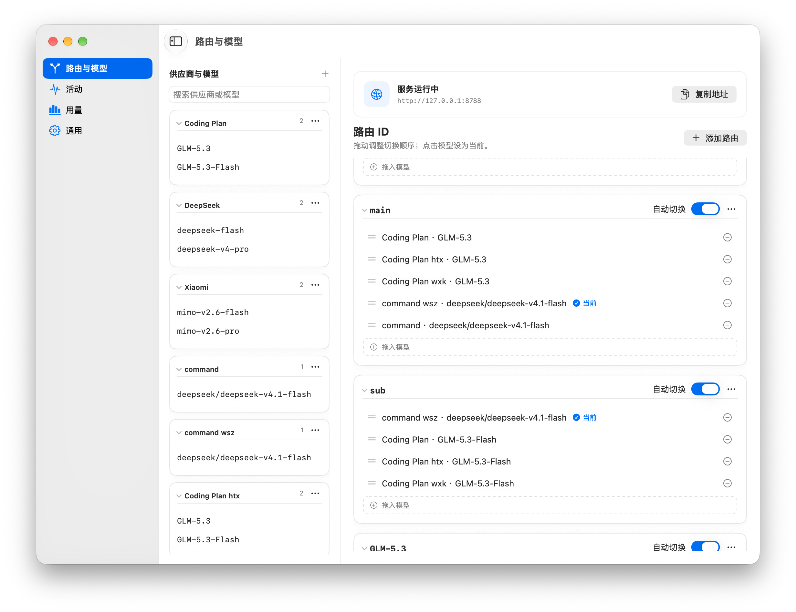
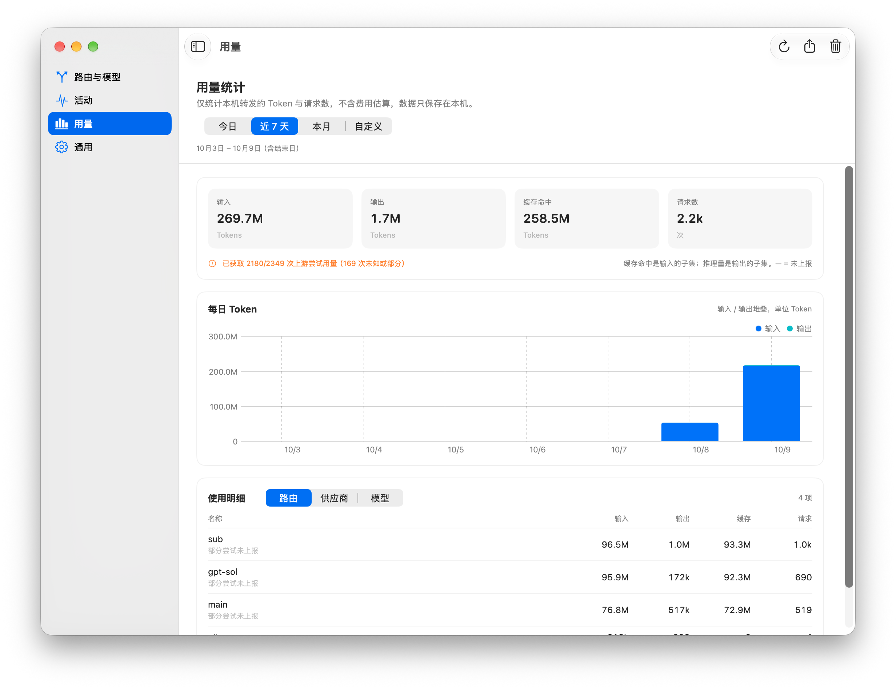

# EZ Switch

**轻量级 macOS 原生大模型反向代理工具。** 在本机提供 OpenAI / Anthropic 兼容接口，让 Codex、Claude Code、OpenCode 等工具始终请求固定的本机模型 ID，真实上游供应商与模型在 EZ Switch 中随时切换。

## 为什么用 EZ Switch

- **热切换模型**：工具侧只认本机模型 ID，在 GUI 或菜单栏切换真实上游模型立即生效，不需要改 harness 配置或重启客户端。
- **自动回退**：开启后，套餐限额或限流返回 HTTP 429、上游临时故障（500/502/503/504）或连接失败时，按候选顺序自动切换上游模型。可在“通用”页开启“自动切换通知”（默认关闭），每次开始回退到下一个候选时发送系统通知。
- **集中管理供应商**：API Key、Base URL、请求头和模型列表统一放在 EZ Switch，不需要在每个工具里重复配置。
- **本地原生应用**：macOS 原生 GUI，服务只监听 `127.0.0.1`，请求直接转发到配置的上游。

## 界面预览





## 安装

从 [GitHub Releases](https://github.com/LuohaoSun/ez-switch/releases) 下载最新 `EZSwitch-*.dmg`，打开后将 `EZSwitch.app` 拖入 `Applications`。要求 macOS 13 或以上，Release 为 Apple Silicon（arm64）版本。

> 当前 DMG 使用 ad-hoc 签名，未经过 Apple Developer ID 公证。首次启动如被 macOS 阻止，请前往 `系统设置 → 隐私与安全性`，在安全提示中点击 **“仍要打开”**，然后再次确认打开应用。

## 快速开始

首次启动会打开设置窗口，并预置一个 `DeepSeek官方 · deepseek-flash` 供应商示例，`main` 默认指向它。已有配置不会被更新为新示例。侧栏可切换“路由与模型”“用量”“活动”“通用”。

本地服务默认地址：

```text
http://127.0.0.1:8788
```

### 1. 配置供应商

在“路由与模型”页左侧添加供应商，填写连接信息：

- 供应商名称
- Chat Completions、Responses、Messages 三类接口是否启用
- 每类接口对应的完整 Base URL
- API Key 和可选额外请求头

点击“获取模型列表”请求供应商接口，用原生复选框勾选要添加的模型后保存；可一次勾选多个，获取失败可修改设置后重试，未选模型不会创建供应商。同一供应商下的所有模型共用这套连接配置，不支持列表接口的供应商仍可手动添加模型。

### 2. 配置路由与自动回退

路由页预置固定的本机模型 ID `main`。把左侧模型拖到右侧路由的任意插入位置即可添加候选，在右侧上下拖动调整自动切换顺序，点击某个模型将它设为当前模型；每条路由可单独开关“自动切换”。Codex 和 Claude Code 会自动选一个兼容 ID 作为默认模型，其余兼容 ID 可在工具中显式指定；OpenCode 的提示词包含全部本机模型 ID。

自动切换产生的多次上游尝试归属于同一个请求；已开始输出的流无法中途切换。活动日志记录切换时的路由、失败模型、尝试序号、HTTP 状态或连接错误与下一个模型，并遮蔽该供应商的凭据。

### 3. 接入工具

在“通用”页的“接入工具”中选择：

- **Codex** / **Claude Code**：点击“一键配置”接入本机端点，无需逐个选模型；应用会在确认后备份用户级配置，可“一键恢复”。重新启动对应工具后生效。
- **OpenCode**：页面展示包含端点与全部本机模型 ID 的提示词，可通过“复制提示词”交给 agent；不提供一键配置。

其他 OpenAI-compatible 工具填写 `base_url = http://127.0.0.1:8788/v1`、`api_key = any-local-placeholder`、`model = main` 即可。这里的 key 只用于满足工具的启动检查，真实上游 API Key 保存在 EZ Switch 中。

### 4. 用量与隐私

侧栏“用量”按今日、近 7 天、本月或自定义日期查看输入／输出、缓存命中与请求数，提供每日趋势、按路由／供应商／模型分组及 CSV 导出。统计仅覆盖经过本机代理的请求，从启用后开始，不代表供应商账单，也不估算费用；缺失的 usage 标记为未知，不记成零。数据保存在配置目录的本地 `usage.sqlite`（使用 macOS 系统 SQLite），不存提示词、回答正文或密钥，数据库异常不影响转发。详见[用量统计说明](Docs/token-usage.md)。

## 支持的接口

| 本机接口 | 用途 | 上游路径 |
| --- | --- | --- |
| `/v1/chat/completions` | OpenAI Chat Completions | Base URL + `/chat/completions` |
| `/v1/responses` | OpenAI Responses / Codex | Base URL + `/responses` |
| `/v1/messages` | Anthropic Messages / Claude Code | Base URL + `/v1/messages` |

默认按原协议转发，不做协议翻译；上游不支持某类接口时会原样返回上游错误。

供应商的 Responses 可设为“转发到 Chat”，经 [CLIProxyAPI](https://github.com/router-for-me/CLIProxyAPI) 的 Go 转换器对接仅支持 Chat Completions 的上游：Codex 仍请求本机 `/v1/responses`，应用由内置转换器生成 Chat 请求并把响应转回 Responses。该模式要求 Codex 发送完整历史，明确拒绝 `previous_response_id`、`conversation` 和远程压缩，转换并非无损；未启用转换的路由保持原生 Responses 转发。

## 命令行入口 ezs

应用包内含命令行工具 `Contents/MacOS/ezs`。把 `EZSwitch.app` 安装到 `Applications` 后，在“通用”页点击“安装命令行工具”，应用会在 `/usr/local/bin/ezs` 创建指向应用内命令的符号链接（必要时由系统请求管理员授权）。CLI 经用户私有目录中的 Unix socket 与应用通信，不直接修改配置文件；应用未运行时命令报错。

```bash
ezs --help
ezs list
ezs set main --provider "command-wsz" --model "deepseek/deepseek-v4.1-flash"

# 查看用量：默认今天、按路由分组、最多 100 组
ezs usage
ezs usage --period 7d --group provider
ezs usage --from 2026-01-01 --to 2026-01-31 --limit 1000
ezs usage --json
```

`list` 显示各本机模型 ID 的绑定及各供应商下的可选模型；`set` 让运行中的应用立即切换并保存。`usage` 与应用内“用量”页同一数据源，支持 `today|7d|month` 预设或 `--from`／`--to` 自定义区间、`route|provider|model` 分组与 `--json` 输出；覆盖率不足时明确标注为“已上报部分”，不做估算。

> `usage` 命令从 0.3.2 起提供；应用和 CLI 都需更新到 0.3.2 或以上。

## 配置与限制

配置文件位于 `~/Library/Application Support/EZSwitch/config.json`。

- 服务只监听本机，不提供远程访问和鉴权。
- 修改端口后需要重启应用。
- 每条路由有独立的有序候选列表，按可回退的上游失败顺序尝试；不做负载均衡。
- 默认按原协议转发；Responses → Chat 转换需在供应商中单独启用。
- 客户端请求头按端到端语义透传（含会话头、SDK 头与自定义头）；hop-by-hop 字段（含 `Connection` 声明的字段）、`Host`、`Content-Length`、`Accept-Encoding` 由本机或 URLSession 重新生成，供应商鉴权头按端点替换为配置的 API Key。供应商 `extraHeaders` 最后应用，可覆盖以上任何值。

## 许可证

[MIT License](LICENSE)。Responses → Chat 转换使用 CLIProxyAPI；该项目及其他第三方依赖的来源、版本与许可声明见 [ThirdParty/README.md](ThirdParty/README.md)。
