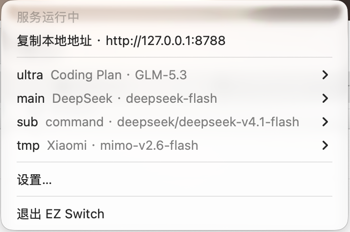

# EZ Switch

**轻量级 macOS 原生大模型反向代理工具。**

EZ Switch 在本机提供 OpenAI / Anthropic 兼容接口。Codex、Claude Code 可一键接入本机端点，无需逐个选择模型；兼容的本机模型 ID 都可按需指定。OpenCode 可通过应用生成的提示词配置全部本机模型 ID。之后在 EZ Switch 中切换真实供应商和模型，立即生效，不需要修改 harness 配置或重启客户端。

## 为什么用 EZ Switch

- **热切换模型**：工具侧始终请求固定的本机模型 ID，真实上游模型可在 GUI 或菜单栏中随时切换。
- **集中管理供应商**：API Key、Base URL、请求头和模型列表统一放在 EZ Switch，不需要在每个工具里重复配置。
- **本地原生应用**：macOS 原生 GUI，服务只监听 `127.0.0.1`，请求直接转发到配置的上游。

## 安装

从 [GitHub Releases](https://github.com/LuohaoSun/ez-switch/releases) 下载最新 `EZSwitch-*.dmg`，打开后将 `EZ Switch.app` 拖入 `Applications` 文件夹。要求 macOS 13 或以上。

> 当前 DMG 使用 ad-hoc 签名，未经过 Apple Developer ID 公证。首次启动如被 macOS 阻止，请前往 `系统设置 → 隐私与安全性`，在安全提示中点击 **“仍要打开”**，然后再次确认打开应用。

## 使用

首次启动会打开设置窗口，并预置 `DeepSeek官方 · deepseek-flash` 和 `OpenCode Go · deepseek-v4.1-flash` 两个供应商示例；`main` 默认指向 OpenCode Go。在“路由与模型”页左侧编辑供应商并填写自己的 API Key（Go 需要订阅密钥）；默认模型和 Base URL 可以按需修改。已有配置不会被更新为新示例。

OpenCode Go 使用 Chat Completions 地址 `https://opencode.ai/zen/go/v1`，要求请求包含每个对话稳定的 `x-opencode-session` 和客户端 `User-Agent`。EZ Switch 转发客户端传入的会话头，并在没有 `User-Agent` 时使用自身标识；不在供应商的额外请求头中设置固定会话 ID。客户端不发送会话头时，EZ Switch 无法推断对话归属，Go 的会话路由和缓存效果可能受影响。

本地服务默认地址：

```text
http://127.0.0.1:8788
```

应用启动时及运行期间每 24 小时会自动检查更新（可在“通用”页关闭），发现新版本后会在菜单栏提示；也可以在“通用”页手动检查。下载更新时会校验 DMG 的 SHA-256 并打开安装，不会自动安装。

面板采用系统侧栏，可切换“路由与模型”“用量”“活动”“通用”，通过工具栏按钮隐藏或显示侧栏。默认窗口为 1120 × 760（最小 1000 × 640）；供应商栏初始约 280 点、可在 220–300 点间拖动调整，路由栏自动占据剩余宽度，最外侧保留约 20 点外边距。侧栏由原生分割视图控制，显示或隐藏时只调整两侧栏宽，窗口宽度保持不变。长模型名称在行内省略，不会挤出右侧操作按钮。应用菜单中的“EZ Switch 面板…”及 `⌘,` 可打开面板。

### 1. 配置供应商

在“路由与模型”页左侧添加供应商时，先填写连接信息：

- 供应商名称
- Chat Completions、Responses、Messages 三类接口是否启用
- 每类接口对应的完整 Base URL
- API Key 和可选额外请求头

点击“获取模型列表”后，应用自动请求供应商接口，用原生复选框勾选要添加的模型，再保存供应商。可以一次勾选多个模型；无需输入首个模型，获取失败可修改设置后重试，未选模型时不会创建供应商。

同一供应商的 API Key 和接口配置统一生效，供应商下的全部模型共用。在供应商的「⋯」菜单中选择“获取模型列表”可请求当前接口的 `/models`，选择返回的模型 ID 加入本地模型库；不支持列表接口的供应商仍可手动添加模型。供应商和路由均用圆角卡片分组，点击标题展开或收起。macOS 27 及以上使用 SwiftUI 原生卡片重排，拖动标题时由系统处理占位和周围卡片让位，松手后保存顺序；macOS 13–26 使用原生列表重排。搜索供应商时禁止调整卡片顺序。供应商内的模型行可拖到右侧路由的任意插入位置；在供应商内上下拖动可调整同一供应商内的模型顺序，跨供应商拖动会被拒绝。搜索供应商或模型时仍可把模型拖出到路由，但禁用供应商内部排序。收起的路由仍显示当前模型。两侧列表隐藏滚动指示条，滚动操作仍可用。

### 2. 配置路由

首次启动会预置一个固定的本机模型 ID：

```text
main
```

在“路由与模型”页右侧可为每个本机模型 ID 排列候选模型：从左侧拖入模型，在右侧拖动调整自动切换顺序；点击某个模型即可将它设为当前模型，列表顺序不变。每条路由可单独开关自动切换。当前模型遇到 HTTP 429、临时上游错误（500、502、503、504）或连接失败时，服务在响应开始前尝试下一个兼容模型；失败模型冷却约一分钟后重新参与选择。401、400 等请求或凭据错误不会触发切换。已开始输出的流无法中途切换。旧配置的单模型绑定保持可用。活动日志会记录切换时的路由、失败模型、尝试序号、HTTP 状态或连接错误、上游错误摘要与下一个模型；摘要限长并遮蔽该供应商的凭据。Codex 和 Claude Code 自动选择一个兼容 ID 作为默认模型，其余兼容 ID 可在工具中显式指定；OpenCode 的提示词会包含全部本机模型 ID。

### 用量统计

侧栏“用量”按今日、近 7 天、本月或自定义日期查看输入、输出、缓存命中与请求数，提供每日趋势、路由／供应商／模型分组及 CSV 导出。自动切换产生的多次上游尝试归属于同一个请求；缺失的 usage 标记为未知，不记成零。缓存与推理 tokens 属于输入／输出的细分，不重复相加。

统计从启用后开始，仅覆盖经过本机代理的请求，不代表供应商账单。SQLite 使用 macOS 系统库，数据保存在配置目录的 `usage.sqlite`，升级应用不会覆盖；不存提示词、回答正文或密钥。数据库异常不影响转发。详见[用量统计说明](Docs/token-usage.md)。

### 3. 接入工具

在“通用”页的“接入工具”中，从 Codex、Claude Code、OpenCode 三项中选择要接入的工具：

- **Codex**：点击“一键配置”即可接入本机端点，无需逐个选模型；自动优先以支持 Responses 协议的 `main` 为默认模型（否则使用第一个兼容 ID）。其他兼容 ID 可用 `codex -m <ID>` 指定。
- **Claude Code**：点击“一键配置”即可接入本机端点，无需逐个选模型；自动优先以支持 Messages 协议的 `main` 为默认模型（否则使用第一个兼容 ID）。其他兼容 ID 可用 `claude --model <ID>` 指定。
- **OpenCode**：选择后，页面会展示包含端点、密钥占位符和全部本机模型 ID 的提示词，可通过“复制提示词”交给 agent；OpenCode 不提供一键配置或一键恢复。

使用 Codex 或 Claude Code 的一键配置时，应用会在确认后修改用户级配置并备份原文件；“一键恢复”检测到文件后续变化时会停止并保留备份，避免通常情况下覆盖新设置。跨进程的同时写入无法保证完全避免，请勿在其他工具正编辑同一配置时操作。备份位于 `~/Library/Application Support/EZSwitch/HarnessBackups/`，其中可能含有原配置的密钥。重新启动对应工具后生效；项目级、命令行或组织管理的设置仍可能覆盖用户级设置。其他本机模型能否成功请求取决于当前上游是否支持该工具使用的 API 协议；Codex 的内置模型列表不一定列出这些自定义 ID。

Codex 示例配置：

```toml
model = "main"
model_provider = "ezswitch"

[model_providers.ezswitch]
name = "EZ Switch"
base_url = "http://127.0.0.1:8788/v1"
wire_api = "responses"
env_key = "EZSWITCH_KEY"
```

```bash
export EZSWITCH_KEY=any-local-placeholder
codex
```

这里的 key 只用于满足工具的启动检查；真实上游 API Key 保存在 EZ Switch 中。
一键配置会直接在用户级 Codex provider 中写入 `ez-switch-local` 占位 token，无需设置上面示例的 `EZSWITCH_KEY`；手动配置时仍可选择环境变量方式。

其他 OpenAI-compatible 工具可填写：

```text
base_url = http://127.0.0.1:8788/v1
api_key  = any-local-placeholder
model    = main
```

Claude Code 可设置：

```bash
export ANTHROPIC_BASE_URL=http://127.0.0.1:8788
export ANTHROPIC_AUTH_TOKEN=any-local-placeholder
export ANTHROPIC_MODEL=main
claude
```

## 命令行切换

应用包内含命令行工具 `Contents/MacOS/ezs`。请先将 `EZSwitch.app` 安装到 `Applications`，再在“通用”页点击“安装命令行工具”。应用会在 `/usr/local/bin/ezs` 创建指向应用内命令的符号链接，必要时由系统请求管理员授权。若目标位置已有其他文件或不同目标的链接，会保留原文件并提示冲突。后续更新 App 时，CLI 随之更新；移动或删除 `/Applications/EZSwitch.app` 会使链接失效。安装后可在终端运行：

```bash
ezs --help
ezs list
ezs set main --provider "command-wsz" --model "deepseek/deepseek-v4.1-flash"
# 当名称有歧义时，可通过配置中的 UUID 精确指定：
ezs set main --remote-id <UUID>
```

`list` 一次显示当前本机模型 ID 的绑定及各供应商下的可选模型。`set` 会让正在运行的 EZ Switch 立即切换并保存；应用未运行时命令报错。CLI 经用户私有目录中的 Unix socket 与应用通信，不直接修改配置文件。使用自定义 `EZSWITCH_CONFIG`（或旧 `MODEL_ROUTER_CONFIG`）启动应用时，CLI 需使用相同的环境变量。正在执行的请求仍使用切换前选中的上游。

## 切换模型



点击菜单栏中的 EZ Switch 图标，可在每个本机模型 ID 已添加的候选模型之间切换；菜单不会显示其他未绑定模型，也不会修改候选列表顺序。切换立即写盘并生效；正在运行的请求不会被中断。

## 支持的接口

| 本机接口 | 用途 | 上游路径 |
| --- | --- | --- |
| `/v1/chat/completions` | OpenAI Chat Completions | Base URL + `/chat/completions` |
| `/v1/responses` | OpenAI Responses / Codex | Base URL + `/responses` |
| `/v1/messages` | Anthropic Messages / Claude Code | Base URL + `/v1/messages` |

默认按原协议转发；上游不支持某类接口时，会原样返回上游错误。供应商的 Responses 也可设为“转发到 Chat”，通过内置转换器对接仅支持 Chat Completions 的上游，具体限制见下文。

## 配置与限制

配置文件路径：

```text
~/Library/Application Support/EZSwitch/config.json
```

- 服务只监听本机，不提供远程访问和鉴权。
- 修改端口后需要重启应用。
- 每条路由有独立的有序候选模型列表，按需在可重试的上游失败后切换；不做负载均衡。
- 不翻译 API 协议；Responses → Chat 转换模式需单独启用。

## 许可证

[MIT License](LICENSE)

## Responses → Chat 转换

v0.2.0 的正式应用包含 Responses → Chat 转换器，构建需要 Swift 与 Go 1.26+；可通过 `GO_BIN=/path/to/go ./build-app.sh` 指定 Go。

`./build-feature.sh` 构建独立的 `dist/EZSwitch-ChatPreview.app`（不安装，也不覆盖当前 `/Applications/EZSwitch.app`）。建议测试时设置独立的 `EZSWITCH_CONFIG` 和不同服务端口，再启动预览 App。预览版签名与正式版不同，不自动注册开机启动。

运行 `./run-feature.sh` 可启动独立预览实例：首次将现有配置复制到 `~/Library/Application Support/EZSwitch-ChatPreview/config.json`，监听 `18988`，后续不会覆盖这份预览配置。Codex 测试客户端的 Base URL 应指向 `http://127.0.0.1:18988/v1`。可通过 `EZSWITCH_PREVIEW_PORT` 修改预览端口。

在供应商设置里，将 Responses 设为“转发到 Chat”，并启用 Chat Completions、填写其 Base URL；无需另填转发地址。Codex 仍请求 EZ Switch 的 `/v1/responses`；应用经 [CLIProxyAPI](https://github.com/router-for-me/CLIProxyAPI) 的 Go 转换器生成 Chat 请求，并把上游 Chat 响应转换为 Responses 流或 JSON。未选转换的路由保持原生 Responses 转发。第三方组件的许可证和版本见 [ThirdParty/README.md](ThirdParty/README.md)。

此模式要求 Codex 在 `input` 中发送完整历史，明确拒绝 `previous_response_id`、`conversation` 和远程压缩；遇到这些功能应使用原生 Responses 上游。已验证普通请求、流式结束、工具调用与结果续接。协议转换不是无损的，正式使用前仍需在目标供应商和具体 Codex 版本上测试长会话、并行工具和压缩行为。
